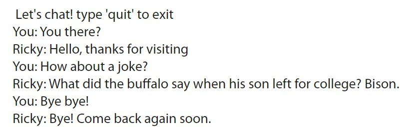

# Simple chatbot with linear regression
A simple model with 3 linear layers and 1 ReLU to predict the response for a given speech. Your input doesn't have to match perfectly with the the corpora, the NN will learn it.

## Dependency
- Pytorch
- NLTK

## Usage
Configure the speech patterns and relative responses for your own use in **intents.json**.

```
python chat.py
```
## Example

